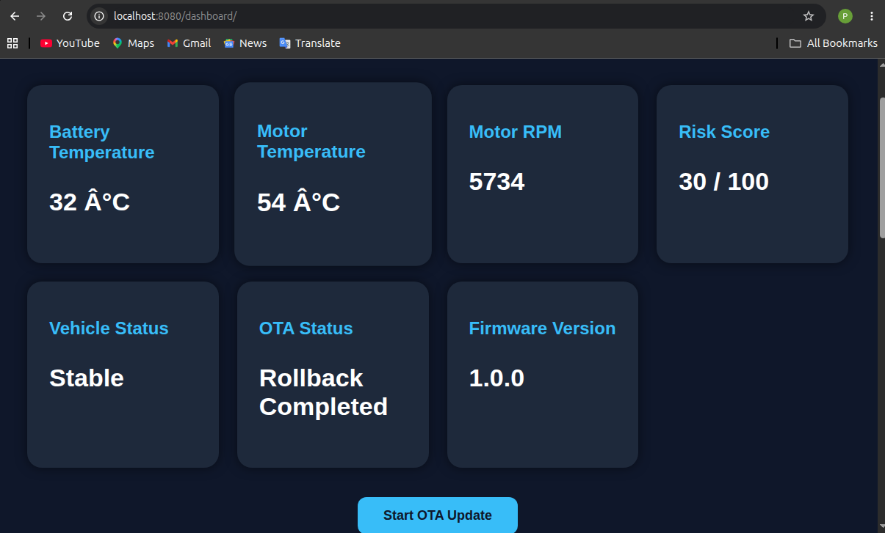
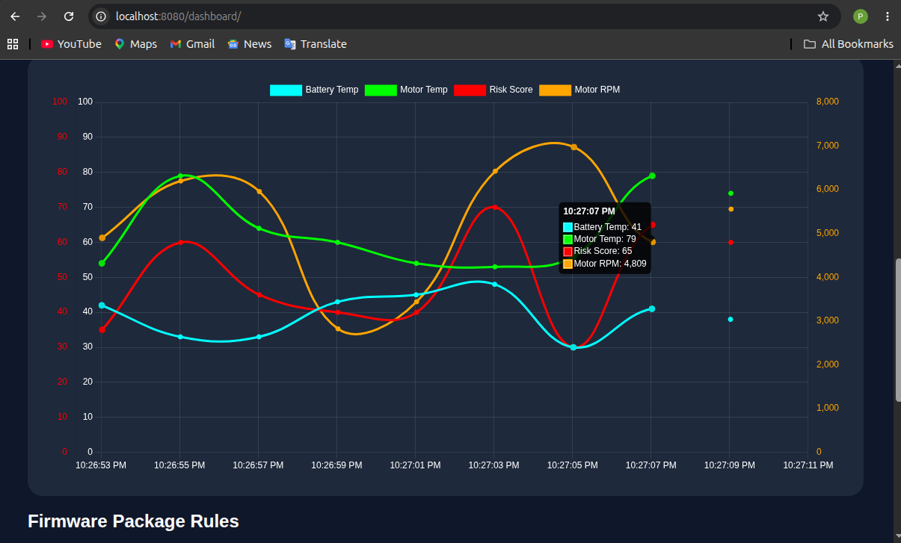
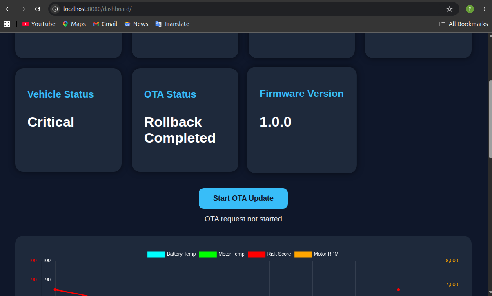
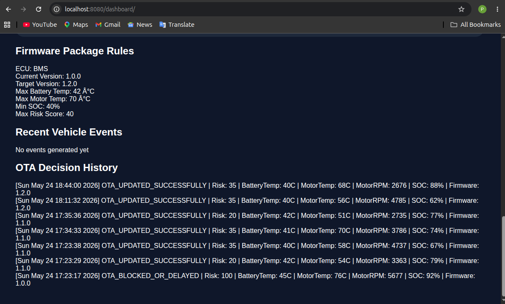

# NeuroVolt AI OTA System

NeuroVolt AI OTA System is an AI-driven automotive middleware simulation platform built using **C++**, **Linux SocketCAN**, **FastAPI**, and a **real-time web dashboard**.

The project simulates electric vehicle ECU telemetry, analyzes vehicle health using AI-style risk scoring, validates OTA firmware updates against live vehicle conditions, and provides a dashboard-controlled OTA deployment workflow.

---

## Project Objective

Modern electric vehicles depend heavily on software updates, connected ECUs, battery systems, motor controllers, and safety-critical telemetry.

A firmware update should not be deployed blindly if the vehicle is operating under unsafe thermal or electrical conditions.

This project solves that problem by creating a simulated EV OTA safety platform that:

- Reads live CAN telemetry
- Analyzes battery and motor health
- Calculates vehicle risk score
- Validates OTA updates using firmware package rules
- Allows, delays, blocks, or rolls back OTA deployment
- Maintains OTA audit history
- Displays live telemetry on a real-time dashboard

---

## Key Features

- Linux SocketCAN based virtual CAN communication
- Virtual BMS ECU simulation
- Virtual Motor ECU simulation
- AI thermal analysis agent
- Motor health analysis agent
- Vehicle orchestrator for multi-ECU health evaluation
- Vehicle risk scoring engine
- OTA safety validator
- Firmware package configuration system
- Dashboard-triggered OTA update workflow
- FastAPI backend APIs
- Real-time dashboard with live charts
- OTA decision history and audit trail
- Event logging system
- Firmware package rules panel
- One-command run and stop scripts

---

## Tech Stack

### Core Middleware

- C++
- Linux
- SocketCAN
- CMake
- Multithreading

### Backend

- Python
- FastAPI
- Uvicorn

### Dashboard

- HTML
- CSS
- JavaScript
- Chart.js

### AI / Analytics

- Rule-based AI agents
- Risk scoring engine
- Predictive thermal alerting
- ML anomaly detection foundation

---

## Documentation

- [Architecture Documentation](docs/architecture.md)
- [API Documentation](docs/api_documentation.md)
- [Demo Flow](docs/demo_flow.md)
- [Patent-Oriented Concept Note](docs/patent_note.md)

---

## System Architecture

```text
BMS ECU Simulator
        |
        | CAN ID: 0x200
        v
Virtual CAN Bus - vcan0
        ^
        | CAN ID: 0x300
        |
Motor ECU Simulator
        |
        v
C++ CAN Middleware
        |
        v
AI Agents
        |
        |-- ThermalAgent
        |-- MotorAgent
        |-- VehicleOrchestrator
        |
        v
Risk Scoring Engine
        |
        v
OTA Safety Validator
        |
        v
Firmware Package Rules
        |
        v
OTA Manager
        |
        v
Telemetry Logger + Event Logger + OTA History Logger
        |
        v
FastAPI Backend
        |
        v
Real-time Dashboard
```

---

## OTA Workflow

```text
Dashboard Start OTA Button
        |
        v
FastAPI creates OTA request
        |
        v
C++ middleware detects OTA request
        |
        v
Firmware package config is loaded
        |
        v
Live vehicle telemetry is evaluated
        |
        v
Risk score is calculated
        |
        v
OTA is allowed, delayed, blocked, or rolled back
        |
        v
Decision is logged in OTA history
        |
        v
Dashboard updates OTA status and audit trail
```

---

## Dashboard Preview

The dashboard displays live EV telemetry, vehicle risk score, OTA status, firmware version, firmware package rules, live graphs, vehicle events, and OTA decision history.



---

## Live Telemetry Graph

The dashboard visualizes battery temperature, motor temperature, motor RPM, and risk score in real time.



---

## OTA Update Trigger

OTA updates are triggered from the dashboard. The update request is sent to the FastAPI backend, then processed by the C++ middleware using live vehicle telemetry and firmware package rules.



---

## Firmware Package Rules

Firmware package rules define safety constraints for OTA deployment, such as maximum battery temperature, maximum motor temperature, minimum SOC, and maximum allowed risk score.



---

## Firmware Package Configuration

Firmware update rules are defined in:

```text
configs/firmware_package.json
```

Example:

```json
{
  "ecu": "BMS",
  "currentVersion": "1.0.0",
  "targetVersion": "1.2.0",
  "requiredBatteryTempMax": 42,
  "requiredMotorTempMax": 70,
  "minSOC": 40,
  "maxAllowedRiskScore": 40
}
```

The OTA update is validated against these runtime safety constraints before deployment.

---

## API Endpoints

| Method | Endpoint | Purpose |
|---|---|---|
| GET | `/telemetry` | Returns live EV telemetry |
| POST | `/start-ota` | Triggers OTA update request |
| GET | `/events` | Returns latest vehicle events |
| GET | `/ota-history` | Returns OTA audit history |
| GET | `/firmware-package` | Returns firmware package rules |

---

## Dashboard Data Points

The dashboard shows:

- Battery Temperature
- Motor Temperature
- Motor RPM
- Risk Score
- Vehicle Status
- OTA Status
- Firmware Version
- Firmware Package Rules
- Live Telemetry Graph
- Recent Vehicle Events
- OTA Decision History

---

## OTA Decision Logic

The OTA update is not deployed blindly. The system evaluates:

- Battery temperature
- Motor temperature
- Motor RPM
- Battery state of charge
- Vehicle risk score
- Firmware package constraints

Possible OTA outcomes:

```text
OTA_UPDATED_SUCCESSFULLY
OTA_BLOCKED_BY_PACKAGE_RULES
OTA_ALREADY_UP_TO_DATE
ROLLBACK_COMPLETED
```

---

## How to Run

### 1. Clone the repository

```bash
git clone <repo-url>
cd NeuroVolt-OTA
```

### 2. Run complete system

```bash
./scripts/run_all.sh
```

This starts:

- vCAN interface
- C++ middleware
- FastAPI backend
- Dashboard server

### 3. Open dashboard

```text
http://localhost:8080/dashboard/
```

### 4. Stop all services

```bash
./scripts/stop_all.sh
```

---

## Manual Run

### Setup virtual CAN

```bash
sudo modprobe vcan
sudo ip link add dev vcan0 type vcan
sudo ip link set up vcan0
```

### Build and run C++ middleware

```bash
cd build
cmake ..
make
sudo ./NeuroVoltOTA
```

### Run FastAPI backend

```bash
cd backend
source ../venv/bin/activate
uvicorn main:app --reload
```

### Run dashboard server

```bash
python3 -m http.server 8080
```

Open:

```text
http://localhost:8080/dashboard/
```

---

## Expected OTA Behavior

If vehicle conditions are safe:

```text
[OTA VALIDATOR] Firmware package rules satisfied
[OTA] Deploying firmware update...
[OTA STATUS] Firmware updated successfully
```

If vehicle conditions are unsafe:

```text
[OTA BLOCKED] Risk score exceeds firmware package limit
[OTA ACTION] Update delayed due to firmware package safety rules
```

If firmware is already updated:

```text
[OTA STATUS] Firmware already up to date
[OTA ACTION] No deployment required
```

---

## Project Highlights

This project demonstrates:

- Automotive middleware design
- C++ systems programming
- Linux SocketCAN communication
- Multi-ECU telemetry simulation
- AI-based vehicle risk scoring
- OTA safety validation
- Dashboard-controlled OTA deployment
- FastAPI backend integration
- Real-time dashboard visualization
- Firmware package based update validation
- Event-driven OTA audit logging

---

## Future Enhancements

- WebSocket based live streaming
- MQTT broker integration
- Docker deployment
- Cloud telemetry simulation
- Real ML anomaly detection model
- Digital twin vehicle simulation
- AUTOSAR-inspired module separation
- Fleet-level OTA management
- Authentication and role-based access
- CI/CD pipeline

---

## Author

**Purvak Pal**

Automotive Software Developer | C++ | Android | Linux | EV Systems | AI Middleware
